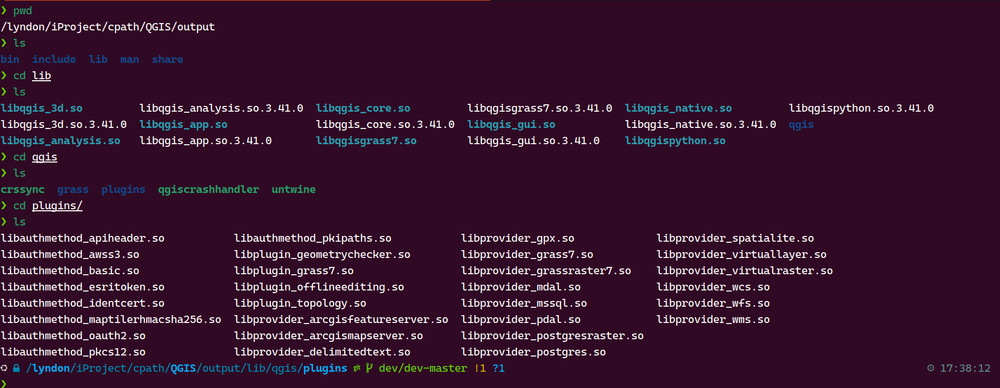

# standalone qgis server

## qgis environment

### plugins dir


### debug main.cpp console output
```console
/lyndon/iProject/cpath/qgis_demo1/cmake-build-debug/qgis_demo1
qgis_source: ""
qgis_provider_file: "wfs;wcs;arcgisvectortileservice;cesiumtiles;copc;ept;gdal;mbtilesvectortiles;memory;mesh_memory;ogr;quantizedmesh;sensorthings;tiledscene;vectortile;vpc;vtpkvectortiles;xyzvectortiles;wms"
Warning: Ignoring XDG_SESSION_TYPE=wayland on Gnome. Use QT_QPA_PLATFORM=wayland to run on Wayland anyway.
plugin type: ""
Failed to load WMS plugin type
wms plugin type: 0x0
project instance:  QgsProject(0x57dc8cc82c00)
set title:  "My QGIS Project"
set crs:  "EPSG:3857"
baseTileUrl:  "http://47.94.145.6/map/lx/{z}/{x}/{y}.png"
baseTileName:  "BaseTile"
qCritical: "<p><b>Raster layer:</b> Cannot instantiate the 'wms' data provider"
qCritical: "Cannot instantiate the 'wms' data provider"
Error adding XYZ layer
save qgs file: "/lyndon/iProject/cpath/qgis_demo1/common/project/temp_project.qgs"
save qgz file: "/lyndon/iProject/cpath/qgis_demo1/common/project/project.qgz"
```